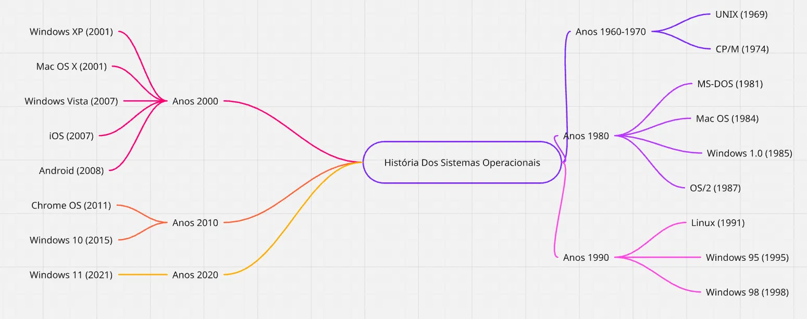

# 📚 Linha do Tempo: Sistemas Operacionais

## 🎯 Mapa Mental - História dos Sistemas Operacionais



*Clique na imagem para ampliar e visualizar melhor a linha do tempo visual*

---

## 📊 Fluxograma da Evolução dos SO

```
┌─────────────────────────────────────────────────────────────┐
│                    HISTÓRIA DOS SO                          │
└─────────────────────────────────────────────────────────────┘
                            │
                ┌───────────┼───────────┐
                │           │           │
          ┌─────▼────┐  ┌──▼───┐  ┌───▼────┐
          │  1950s   │  │1960s │  │ 1970s  │
          │   DOS    │  │UNIX  │  │ CP/M   │
          └──────────┘  └──┬───┘  └───┬────┘
                           │          │
                    ┌──────┴──────┐   │
                    │             │   │
                ┌───▼───┐    ┌───▼──┐
                │ 1980s │    │1990s │
                │Windows│   │Linux │
                │MS-DOS │   │ Win95│
                └───┬───┘    └──┬───┘
                    │           │
                    └─────┬─────┘
                          │
                    ┌─────▼──────┐
                    │  2000s-2020s│
                    │  Android   │
                    │    iOS     │
                    │  Chrome OS │
                    └────────────┘
```

---

## ✅ Checklist de Sistemas Operacionais Principais

### Década de 1950-1960
- [ ] ✓ UNIVAC Operating System (1954)
- [ ] ✓ GM-NAA I/O (1956)
- [ ] ✓ CTSS (1961)
- [ ] ✓ Multics (1964)
- [ ] ✓ Unix (1969)

### Década de 1970-1980
- [ ] ✓ CP/M (1974)
- [ ] ✓ MS-DOS (1981)
- [ ] ✓ Apple Macintosh System (1984)
- [ ] ✓ Windows 1.0 (1985)
- [ ] ✓ OS/2 (1987)
- [ ] ✓ Windows 3.0 (1989)

### Década de 1990
- [ ] ✓ Linux (1991)
- [ ] ✓ Windows NT (1993)
- [ ] ✓ Windows 95 (1995)
- [ ] ✓ Windows 98 (1998)

### Década de 2000
- [ ] ✓ Windows XP (2001)
- [ ] ✓ Mac OS X (2001)
- [ ] ✓ Windows Vista (2006)

### Década de 2010-2020
- [ ] ✓ iOS (2007)
- [ ] ✓ Android (2008)
- [ ] ✓ Windows 10 (2015)
- [ ] ✓ Windows 11 (2021)

---

## 🗓️ Linha do Tempo Detalhada por Décadas

### 🟦 Anos 1950 - Era Experimental

| Ano | SO | Características |
|-----|----|----|
| 1954 | UOS | Primeiro SO jamais desenvolvido |
| 1956 | GM-NAA I/O | Sistema para IBM 704 |

**O que você precisa saber:**
- 🔹 Primeiros passos da computação
- 🔹 Mainframes gigantes e caros
- 🔹 Programação em linguagem de máquina

---

### 🟪 Anos 1960 - Primeiros SO Modernos

| Ano | SO | Características |
|-----|----|----|
| 1961 | CTSS | Compartilhamento de tempo |
| 1964 | Multics | Sistema inovador com segurança |
| 1969 | Unix | Ken Thompson e Dennis Ritchie |

**O que você precisa saber:**
- 🔹 Conceito de compartilhamento de tempo (time-sharing)
- 🔹 Unix é a base para muitos SO modernos
- 🔹 Desenvolvimento nos Laboratórios Bell

---

### 🟩 Anos 1970 - Expansão e Comercialização

| Ano | SO | Características |
|-----|----|----|
| 1971 | Unix v1 | Primeira versão pública |
| 1973 | Unix v4 | Reescrito em C |
| 1974 | CP/M | Primeiro para microcomputadores |
| 1977 | Apple II DOS | Sistema para Apple II |

**O que você precisa saber:**
- 🔹 Transição de mainframes para microcomputadores
- 🔹 CP/M foi o padrão industrial da época
- 🔹 Unix provou portabilidade ao ser reescrito em C

---

### 🟥 Anos 1980 - Revolução dos PCs

| Ano | SO | Características |
|-----|----|----|
| 1981 | MS-DOS 1.0 | Revolucionou o mercado de PCs |
| 1984 | Macintosh System | Interface gráfica revolucionária |
| 1985 | Windows 1.0 | Interface gráfica para MS-DOS |
| 1987 | OS/2 | Parceria IBM e Microsoft |
| 1989 | Windows 3.0 | Grande sucesso comercial |

**O que você precisa saber:**
- 🔹 MS-DOS dominou o mercado corporativo
- 🔹 Macintosh introduziu GUI (Graphical User Interface)
- 🔹 Windows 3.0 foi o ponto de virada do Windows

---

### 🟧 Anos 1990 - Era Windows e Linux

| Ano | SO | Características |
|-----|----|----|
| 1991 | Linux 0.02 | Criado por Linus Torvalds |
| 1993 | FreeBSD 1.0 | Sistema Unix livre |
| 1995 | Windows 95 | Grande revolução na interface |
| 1998 | Windows 98 | Melhorias sobre Windows 95 |

**O que você precisa saber:**
- 🔹 Linux emerge como alternativa open source
- 🔹 Windows 95 dominou o mercado de PCs
- 🔹 Início da era de código aberto

---

### 🟨 Anos 2000 - Era Moderna

| Ano | SO | Características |
|-----|----|----|
| 2000 | Windows 2000 | Windows NT 5.0 |
| 2001 | Windows XP | Um dos mais populares |
| 2001 | Mac OS X 10.0 | Revolução no macOS (baseado em Unix) |
| 2006 | Windows Vista | Ambicioso mas problemático |

**O que você precisa saber:**
- 🔹 Windows XP: suporte de longa duração
- 🔹 Mac OS X mudou para base Unix
- 🔹 Windows Vista foi criticado por problemas de performance

---

### 🔴 Anos 2010-2020 - Era Mobile e Cloud

| Ano | SO | Características |
|-----|----|----|
| 2007 | iOS | Sistema do iPhone |
| 2008 | Android | Sistema móvel livre |
| 2010 | Windows 7 | Sucesso após Vista |
| 2015 | Windows 10 | "Windows como Serviço" |
| 2021 | Windows 11 | Design moderno |

**O que você precisa saber:**
- 🔹 Revolução dos dispositivos móveis
- 🔹 Android domina mercado móvel global
- 🔹 Windows como serviço com atualizações contínuas

---

## 🌳 Mapa Mental das Famílias de SO

```
SISTEMAS OPERACIONAIS
│
├─ FAMILIA UNIX/LINUX
│  ├─ Unix (1969)
│  ├─ BSD
│  ├─ Linux (1991)
│  │  ├─ Ubuntu
│  │  ├─ Debian
│  │  ├─ Red Hat
│  │  └─ Fedora
│  └─ macOS (evolução de Unix)
│
├─ FAMILIA WINDOWS
│  ├─ MS-DOS (1981)
│  ├─ Windows 1-3 (1985-1989)
│  ├─ Windows 95/98 (1995-1998)
│  ├─ Windows NT/2000/XP (2000-2001)
│  ├─ Windows Vista/7/8 (2006-2012)
│  └─ Windows 10/11 (2015+)
│
├─ FAMILIA APPLE
│  ├─ Macintosh System (1984)
│  ├─ Mac OS (1994-2001)
│  └─ macOS (2001+)
│
└─ FAMILIA MOBILE
   ├─ iOS (2007)
   ├─ Android (2008)
   ├─ Windows Phone (2010)
   └─ BlackBerry OS (2002)
```

---

## 📋 Comparativo dos Três Principais

### 🪟 Windows

**Vantagens:** ✅
- Compatibilidade com software empresarial
- Interface intuitiva
- Suporte a games
- Ampla base de usuários

**Desvantagens:** ❌
- Mais vulnerável a malware
- Requer mais recursos
- Menos estável que concorrentes

**Versão Atual:** Windows 11 (2021)

---

### 🍎 macOS

**Vantagens:** ✅
- Segurança robusta
- Integração com ecossistema Apple
- Performance estável
- Excelente design

**Desvantagens:** ❌
- Software menos disponível
- Preço alto
- Menos opções de customização

**Versão Atual:** macOS Sequoia 15.0 (2024)

---

### 🐧 Linux

**Vantagens:** ✅
- Código aberto (Open Source)
- Altamente customizável
- Seguro e estável
- Gratuito

**Desvantagens:** ❌
- Curva de aprendizado mais íngreme
- Menos software disponível
- Suporte menos unificado

**Versão Atual:** Diversas (Ubuntu 24.04 LTS, Fedora, etc.)

---

## 🎓 Dados Estatísticos

### 📈 Mercado de SO (2024)

```
Windows      ████████████████████ 73%
macOS        ███░░░░░░░░░░░░░░░░░ 15%
Linux        ████░░░░░░░░░░░░░░░░ 12%
```

### 📱 Mercado Mobile (2024)

```
Android      ██████████████████░░ 70%
iOS          ██████████░░░░░░░░░░ 30%
```

---

## 🔗 Genealogia dos SO (Árvore Genealógica)

```
                        UNIX (1969)
                            │
                ┌───────────┬┼──────────┐
                │           │          │
             Berkeley     System V   Linux (1991)
             (BSD)                      │
                │                    ┌──┼──┐
                │                    │  │  │
            macOS ◄─────────────────┘  │  └─ Ubuntu
            (2001)                     └─ Debian
                                          └─ Red Hat

            MS-DOS (1981)
                │
        ┌───────┼────────┐
        │       │        │
     Windows CP/M   Xenix
        │
        ├─ Windows 3.0
        ├─ Windows 95
        ├─ Windows NT
        └─ Windows 10/11
```

---

## 💡 Curiosidades Interessantes

🎯 **Unix teve influência em 95% dos SO modernos!**

🏆 **Windows XP foi usado por mais de 20 anos!**

🚀 **Linux alimenta 99% dos supercomputadores!**

📱 **Android roda em mais de 3 bilhões de dispositivos!**

🔐 **macOS é baseado em Unix desde 2001!**

---

## 🎯 Resumo das Eras

| Era | Período | Características | SO Principal |
|-----|---------|-----------------|--------------|
| 🏛️ Mainframe | 1950-1970 | Computadores gigantes, caros | Unix, DOS |
| 💻 PC | 1980-2000 | Computadores pessoais | DOS, Windows, Mac |
| 📱 Mobile | 2007-2024 | Smartphones e tablets | iOS, Android |
| ☁️ Cloud | 2010-2024 | Computação em nuvem | Linux |

---

## 🔮 Futuro dos Sistemas Operacionais

```
Tendências futuras:
├─ 🤖 IA integrada aos SO
├─ 🔐 Segurança aprimorada
├─ ☁️ Computação em nuvem
├─ 🌐 Internet das Coisas (IoT)
└─ 🔧 Mais código aberto
```

---

## 📚 Como Usar Este Documento

### ✅ Checklist de Estudo

Utilize este documento para estudar conforme o checklist abaixo:

- [ ] Ler a linha do tempo completa
- [ ] Memorizar os 5 SO mais importantes
- [ ] Entender a diferença entre Windows, macOS e Linux
- [ ] Saber como inserir imagens em Markdown
- [ ] Compreender a genealogia dos SO

---

## 💾 Como Inserir Imagens em Markdown

### Sintaxe Básica

```markdown

```

### Exemplos Práticos

```markdown
# Imagem Local


# Imagem em URL


# Imagem com Link
[](https://site.com)

# Imagem com Dimensões (nem todos os renderizadores suportam)
{width=300px}
```

### Boas Práticas

✅ **Sempre use:**
- Texto alternativo (alt text) descritivo
- Nomes de arquivo em minúsculas
- Caminho relativo quando possível
- Formatos: PNG, JPG, GIF, WEBP

❌ **Evite:**
- Imagens muito grandes sem compressão
- Textos alternnativos genéricos como "imagem"
- Caminhos absolutos
- Muitas imagens que deixam o arquivo pesado

---

## 📁 Estrutura do Projeto

```
meu-projeto/
├── timeline-so-completo.md  ← Você está aqui!
├── mapa-mental-so.png       ← Imagem do mapa mental
├── imagens/
│   ├── logo-windows.png
│   ├── logo-linux.png
│   └── logo-apple.png
└── README.md
```

---

## 🎓 Conclusão

A evolução dos **Sistemas Operacionais** reflete a história da computação, passando de:

1️⃣ **Mainframes** (1950-1970) → Computadores gigantes
2️⃣ **Computadores Pessoais** (1980-2000) → Windows domina
3️⃣ **Era Mobile** (2007-2024) → Android e iOS reinam
4️⃣ **Cloud Computing** (2010-2024) → Linux predomina

Cada geração trouxe avanços em **usabilidade**, **segurança** e **performance**!

---

## 📞 Referências e Links Úteis

- [História do Unix](https://en.wikipedia.org/wiki/Unix)
- [Linha do Tempo Windows](https://www.microsoft.com)
- [Linux Foundation](https://www.linuxfoundation.org)
- [Apple History](https://www.apple.com/mac)

---

**Criado para estudos de Sistemas Operacionais** 📚
**FATEC Itapetininga** 🎓
**Disciplina: Análise e Desenvolvimento de Sistemas** 💻

---

*Última atualização: 2024*
