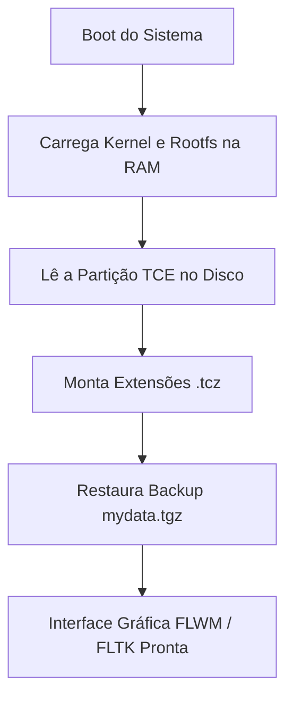
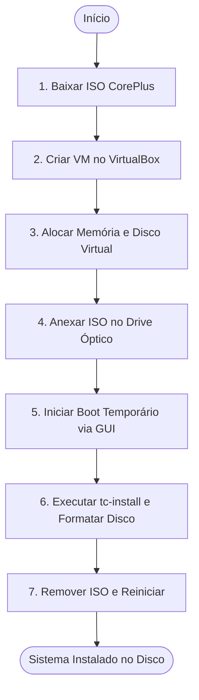
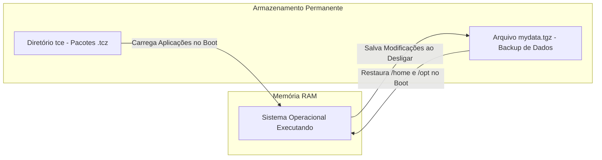

# Manual de Instalação e Funcionalidades do Tiny Core Linux

Este manual documenta o processo passo a passo para a criação e instalação do **Tiny Core Linux** em uma máquina virtual utilizando o **VirtualBox**, além de apresentar suas principais características e funcionalidades.

---

## 1. Visão Geral da Arquitetura e Funcionamento

O Tiny Core Linux opera de maneira diferente das distribuições Linux convencionais. Ele é executado primariamente na memória RAM e utiliza um sistema de extensões modulares.

---

## 2. Passo a Passo de Instalação no VirtualBox

### Fluxograma do Processo de Instalação

---

### Detalhes das Etapas de Instalação

#### 1. Baixar a ISO do Tiny Core (Preparação)
Acesse o site oficial do Tiny Core Linux e baixe a imagem ISO da versão **CorePlus**.
* **Como verificar:** Confirme se você possui um arquivo com a extensão `.iso` salvo em sua pasta de *Downloads*.

#### 2. Criar a Máquina Virtual (VirtualBox)
Abra o VirtualBox e clique em **Novo**.
* **Nome:** `Tiny Core Linux`
* **Tipo:** `Linux`
* **Versão:** `Other Linux (32-bit)` ou `(64-bit)`, dependendo da ISO baixada (geralmente 32-bit).
* Clique em **Próximo**.
* **Como verificar:** A tela avançará para a configuração de hardware sem apresentar erros de nomenclatura.

#### 3. Alocar Memória e Disco (Recursos)
* **Memória (RAM):** O sistema exige muito pouco, mas aloque **512 MB** para garantir fluidez na interface gráfica.
* **Disco Rígido:** Escolha "Criar um novo disco rígido virtual agora". Selecione o formato **VDI**, alocação dinâmica e defina o tamanho para **2 GB**.
* **Como verificar:** A nova máquina virtual aparecerá listada no painel esquerdo da tela inicial do VirtualBox.

#### 4. Anexar a Imagem ISO (Armazenamento)
Selecione a VM criada e clique em **Configurações > Armazenamento**.
* Na árvore de armazenamento, clique no ícone de CD vazio (abaixo de Controladora IDE).
* No painel à direita, clique no ícone de disco e escolha **"Escolher um arquivo de disco..."**.
* Localize e selecione a ISO do CorePlus. Clique em **OK**.
* **Como verificar:** O nome da ISO aparecerá no lugar do disco vazio, indicando que a mídia foi inserida virtualmente.

#### 5. Iniciar o Sistema Temporário (Boot)
Clique em **Iniciar** para ligar a máquina. No menu de boot preto do Tiny Core, selecione a opção **"Boot CorePlus with X/GUI"** e pressione `Enter`.
* **Como verificar:** O sistema carregará em poucos segundos e exibirá uma área de trabalho limpa com uma barra de ícones (dock) na parte inferior da tela.

#### 6. Instalar no Disco Virtual (tc-install)
Na barra inferior, clique no ícone **tc-install** (geralmente ilustrado por um disco com ferramentas).
* Escolha o tipo de instalação **Frugal** e marque **Whole Disk**.
* Selecione o disco rígido virtual, que geralmente aparece como `sda`.
* Escolha a formatação **ext4**.
* Avance deixando as opções de bootloader padrão e clique em **Proceed**.
* **Como verificar:** Uma barra de progresso verde indicará a formatação e cópia dos arquivos, finalizando com a mensagem *"Installation has completed"*.

#### 7. Reiniciar e Validar (Finalização)
Feche a janela do instalador. Vá no menu superior do VirtualBox em **Dispositivos > Discos Ópticos** e clique em **Remover disco do drive virtual**.
* Na barra inferior do Tiny Core, clique no ícone vermelho de **Exit**, selecione **Reboot** e clique em **OK**.
* **Como verificar:** A máquina virtual irá reiniciar e carregar o sistema operacional diretamente do disco rígido virtual que você acabou de configurar, sem depender da ISO baixada.

---

## 3. Principais Funcionalidades do Tiny Core Linux

### Fluxograma do Modelo de Persistência e Pacotes

---

### Funcionalidades e Características Detalhadas

* **Modo de Operação na RAM (RAM-Only / Running from RAM):**
  Durante o boot, todo o sistema operacional é carregado diretamente na memória RAM. Isso resulta em uma execução extremamente rápida e permite que o sistema continue funcionando mesmo se a mídia de boot for removida.

* **Tamanho Ultra Reduzido:**
  A versão base (Core) possui apenas cerca de **17 MB**, enquanto a versão com interface gráfica básica (TinyCore) ocupa cerca de **23 MB**.

* **Sistema Modular de Extensões (`.tcz`):**
  O sistema base não instala programas no disco de forma tradicional. Em vez disso, aplicações (como navegadores ou editores de texto) são baixadas como pacotes compactados chamados `.tcz`, que são montados no sistema de arquivos durante a inicialização.

* **Gerenciador de Pacotes Simples (`AppBrowser`):**
  Possui um utilitário gráfico e via linha de comando para buscar, baixar e instalar extensões do repositório oficial de forma rápida.

* **Persistência Configurável:**
  Como roda na memória, qualquer alteração feita durante o uso é perdida ao desligar, a menos que você configure a persistência. O Tiny Core permite salvar configurações e arquivos de duas formas:
  1. **Backup (`mydata.tgz`):** Salva pastas específicas (como `/home/tc`) em um arquivo compactado ao desligar e restaura no boot.
  2. **Diretório `tce`:** Mantém os programas baixados e configurações em uma partição do HD ou pendrive para montagem automática.

* **Inicialização Quase Instantânea:**
  Devido ao tamanho minúsculo e ao carregamento direto na RAM, o tempo de boot é de apenas alguns segundos, mesmo em hardwares antigos.

* **Requisitos de Hardware Extremamente Baixos:**
  Consegue rodar em computadores antigos (processadores i486 ou superiores) com apenas **46 MB a 64 MB de memória RAM**.

* **Ambiente Gráfico Leve (FLWM / FLTK):**
  A interface gráfica utiliza o gerenciador de janelas FLWM construído sobre a biblioteca FLTK, oferecendo uma área de trabalho funcional sem consumir recursos do processador ou placa de vídeo.