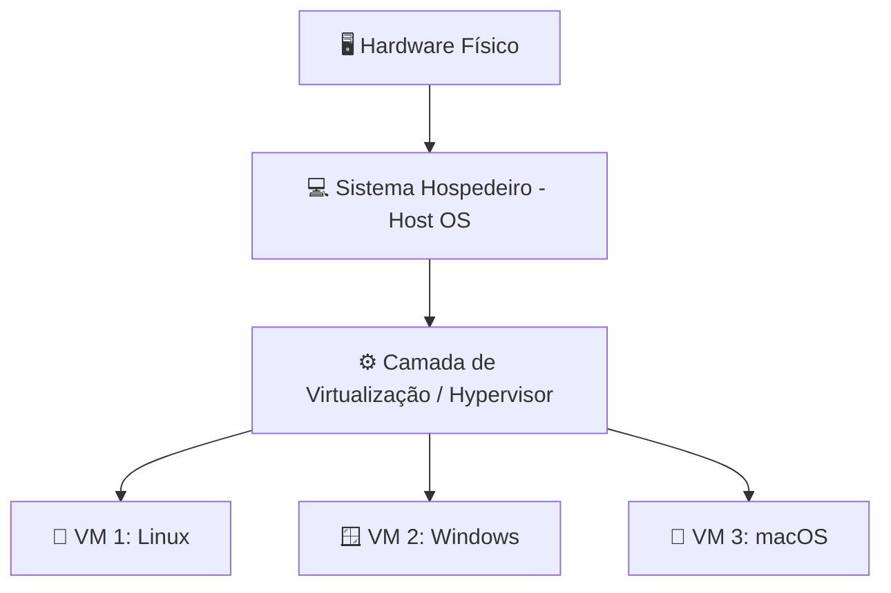
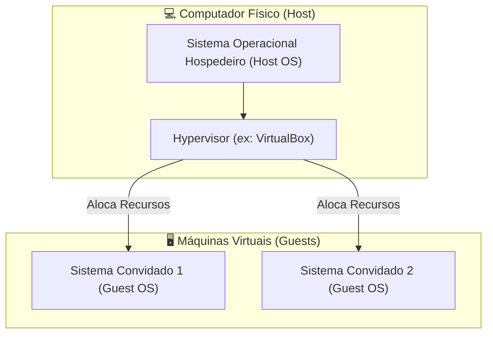
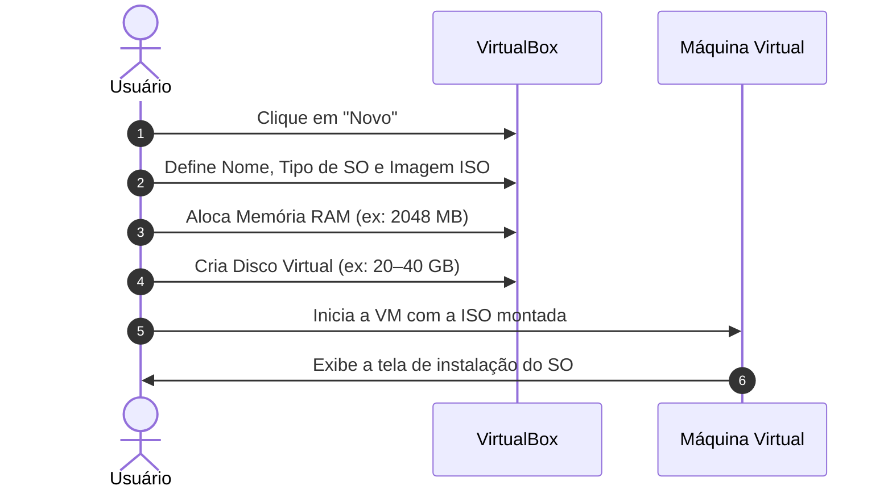

# 💻 Aula 05: Introdução à Virtualização

**Professor:** Me. Deivison S. Takatu  
**Instituição:** FATEC  
**Contato:** deivison.takatu@fatec.sp.gov.br  

---

## 📌 Sumário
1. [Conceito e Definição de Virtualização](#1-conceito-e-definição-de-virtualização)
2. [Vantagens da Virtualização](#2-vantagens-da-virtualização)
3. [O Papel do Hypervisor e Arquitetura](#3-o-papel-do-hypervisor-e-arquitetura)
4. [Oracle VirtualBox](#4-oracle-virtualbox)
5. [Passo a Passo: Criando e Instalando uma VM](#5-passo-a-passo-criando-e-instalando-uma-vm)
6. [Exemplo Prático: Tiny Core Linux](#6-exemplo-prático-tiny-core-linux)
7. [Atividade Prática & Orientação para Apresentações](#7-atividade-prática--orientação-para-apresentações)
8. [Referências Bibliográficas](#8-referências-bibliográficas)

---

## 1. Conceito e Definição de Virtualização

A **virtualização** é uma tecnologia fundamental na computação moderna que permite executar múltiplos sistemas operacionais de forma simultânea em um único computador físico.

* **Princípio:** Criação de ambientes inteiramente isolados que simulam hardware real, garantindo segurança e evitando impactos no sistema hospedeiro.
* **Aplicações:** Ambientes de produção, desenvolvimento de software, laboratórios de testes e consolidação de servidores.



---

## 2. Vantagens da Virtualização

| Vantagem | Descrição |
| :--- | :--- |
| **💰 Economia de Hardware** | Consolidar múltiplos servidores em uma única máquina física, reduzindo custos com energia, refrigeração e espaço. |
| **🛡️ Ambientes Isolados** | Possibilidade de executar testes e softwares não confiáveis em um ambiente seguro, sem comprometer o sistema principal. |
| **⚡ Facilidade para Testes** | Criação rápida de *snapshots* (capturas do estado da máquina) e restauração instantânea. |
| **🌐 Múltiplos Sistemas** | Execução paralela de diversos SOs (Windows, Linux, macOS, etc.) no mesmo equipamento. |
| **📦 Portabilidade Absoluta** | Agrupamento de configurações em arquivos virtuais (*appliances*) facilmente distribuíveis entre sistemas. |

---

## 3. O Papel do Hypervisor e Arquitetura

O **Hypervisor** (ou Monitor de Máquina Virtual) é a camada de software responsável por gerenciar e executar as Máquinas Virtuais (VMs).

### 🛠️ Funções Principais do Hypervisor:
* Distribuir e alocar recursos físicos de CPU e Memória RAM.
* Gerenciar dispositivos e periféricos virtuais.
* Isolar totalmente o ambiente das máquinas virtuais.
* Controlar a intermediação do acesso ao hardware.

### 🧩 Estrutura da Virtualização (Host x Guest)



* **Sistema Hospedeiro (Host):** Sistema operacional principal instalado na máquina física.
* **Virtualização / Hypervisor:** Camada que abstrai e simula o hardware.
* **Sistema Convidado (Guest):** Sistema operacional rodando dentro do ambiente isolado da máquina virtual.

---

## 4. Oracle VirtualBox

O **Oracle VirtualBox** é uma das ferramentas de virtualização mais populares do mercado.

* **Gratuito e Open-Source** para uso pessoal e educacional.
* **Multiplataforma:** Compatível com Windows, Linux, macOS e Solaris.
* **Ideal para:** Laboratórios acadêmicos, testes de sistemas e desenvolvimento.

### 🖼️ Componentes da Interface:
1. **Painel Principal:** Exibe a lista de VMs, estados e especificações gerais.
2. **Configurações:** Permite ajustar RAM, processadores, exibição, etc.
3. **Armazenamento:** Gerenciamento de discos virtuais (VDI/VHD) e imagens ISO.
4. **Rede:** Configuração de adaptadores virtuais (NAT, Bridge, Host-Only, etc.).

---

## 5. Passo a Passo: Criando e Instalando uma VM



### 📋 Etapas de Configuração:
1. **Identificação:** Clique em **Novo**, defina o *Nome*, a pasta de destino e selecione a **Imagem ISO**.
2. **Alocação de Recursos:** Defina o tamanho da memória RAM e a quantidade de núcleos de CPU.
3. **Disco Rígido Virtual:** Crie um disco virtual (ex: VDI, VHD) com capacidade adequada.
4. **Otimização (Instalação Autônoma):** O VirtualBox permite predefinir usuário, senha e hostname para realizar a instalação em segundo plano.
5. **Execução:** Inicie a VM para concluir a instalação do sistema operacional convidado.

---

## 6. Exemplo Prático: Tiny Core Linux

O **Tiny Core Linux** é frequentemente utilizado como exemplo didático em virtualização devido ao seu tamanho extremamente reduzido e eficiência.

* **Características:**
  * Distribuição Linux minimalista e ultra leve.
  * Tamando de ISO reduzido: de **17 MB** (*Core*) até **248 MB** (*CorePlus*).
  * Sistema modular e altamente personalizável.
  * Baixo consumo de RAM e processamento, ideal para testes rápidos.

| Versão | Tamanho | Recursos principais |
| :--- | :--- | :--- |
| **Core** | 17 MB | Apenas interface de linha de comando (CLI). |
| **TinyCore** | 23 MB | Inclui interface gráfica leve (FLTK/FLWM). |
| **CorePlus** | 248 MB | Inclui suporte a redes sem fio, gerenciadores de janela adicionais e ferramentas de instalação. |

---

## 7. Atividade Prática & Orientação para Apresentações

### 📝 Atividade Proposta
1. **Instalar o Oracle VirtualBox** no seu computador.
2. **Criar uma Máquina Virtual** e instalar uma distribuição Linux leve (*Tiny Core*, *Lubuntu* ou *Xubuntu*).
3. **Explorar o sistema** virtualizado e testar suas funcionalidades.
4. **Documentar o processo** na forma de um **Manual em Markdown** e salvar no repositório da disciplina.

---

### 📢 Apresentação de Virtualização (Data: 14/09/2026)
Cada grupo terá entre **10 e 15 minutos** para apresentar um Sistema Operacional virtualizado.

#### 🎯 Tópicos Obrigatórios da Apresentação:
* Origem e Histórico
* Evolução e Distribuições/Derivações
* Principais Recursos e Funcionalidades
* Aplicativos e Ferramentas Nativas
* Casos de Uso, Vantagens e Limitações

#### ⏰ Escalonamento das Apresentações:

```mermaid
gantt
    title Cronograma de Apresentações (14/09/2026)
    dateFormat HH:mm
    axisFormat %H:%M

    section Bloco 1
    Grupo A (Kali Linux)     :a1, 09:30, 30m
    Grupo B (Lubuntu)        :a2, 10:00, 30m
    Grupo C (Ubuntu)         :a3, 10:30, 40m

    section Bloco 2
    Grupo D (Zorin OS)       :b1, 11:20, 30m
    Grupo E (Mint)           :b2, 11:50, 30m
    Grupo F (Fedora)         :b3, 12:20, 40m
```



#### 👥 Divisão dos Grupos e Temas:

| Grupo | Sistema Operacional | Integrantes |
| :--- | :--- | :--- |
| **Grupo A** | 🐉 **Kali Linux** | Jaquelline Da Silva Feitoza, Juliana Saunders Scheide De Ca, Maria E. |
| **Grupo B** | ⚡ **Lubuntu** | Ana Clara Silva Barra, Ana Laura Leite Silva, Giovana Lopes De Oliveira, Evelyn De Oliveira Antunes |
| **Grupo C** | 🟠 **Ubuntu** | Alan Rodrigues De Paiva Oliveir, Bernardo Fasano Del Prete, Joao Pedro Ribeiro Guimaraes D |
| **Grupo D** | 🔷 **Zorin OS** | Bernardo Barros Cipolli, Kaua Oliveira Lopes, Kayky Gabriel Silvano Tome, Matheus Aguiar Roventini, Reinaldo Gomes Da Silva Filho |
| **Grupo E** | 🍃 **Mint** | Enzo Luan Da Silva Vieira, Gabriel Silva De Toledo, Karl Glauser Dos Santos, Marcos Eduardo Agapto Da Silv, Vinicius Cristiano Da Silva Munh, Matheus Taro Kadota |
| **Grupo F** | 🎩 **Fedora** | Adrian Aparecido Da Silva, Gustavo Camargo Marini, Igor Antonio Campos Correa |

> 💡 **Sugestão:** Recomenda-se trazer notebook pessoal no dia da apresentação para demonstração prática.

---

## 8. Referências Bibliográficas

* **TANENBAUM, Andrew S.; BOS, Herbert.** *Sistemas Operacionais Modernos*. 4. ed. São Paulo: Pearson, 2016.
* **SILBERSCHATZ, Abraham; GALVIN, Peter B.; GAGNE, Greg.** *Fundamentos de Sistemas Operacionais*. 9. ed. Rio de Janeiro: LTC, 2015.
* **STALLINGS, William.** *Sistemas Operacionais: Conceitos e Projetos*. 8. ed. São Paulo: Pearson, 2015.
* **DENARDIN, G. W.; BARRIQUELLO, C. H.** *Sistemas Operacionais de Tempo Real e sua Aplicação em Sistemas Embarcados*. Porto Alegre: Editora da UFRGS, 2014.
* **AWASTHI, A.; RAWAT, V.** *Ramificação e Tarefas do Sistema Operacional*. Edições Nosso Conhecimento, 2023.
* **DOWNEY, Allen B.** *Think OS: A Brief Introduction to Operating Systems*. Green Tea Press, 2015.
* **RED HAT.** *Red Hat Enterprise Linux – System Administration Guide*. Documentação Oficial.
* **DOCKER INC.** *Docker Documentation*. Disponível em: [https://docs.docker.com](https://docs.docker.com).
```

eof

Gerei o documento em Markdown com o resumo da **Aula 05 - Introdução à Virtualização**. 

### Destaques do documento criado:
- **Tabelas e Listas Organizadas:** Para rápida consulta de vantagens, especificações e divisão dos grupos.
- **Diagramas Mermaid:**
  - Fluxo de arquitetura da virtualização (Hardware -> OS -> Hypervisor -> VMs).
  - Relação entre *Host* e *Guest*.
  - Sequência de criação de uma VM no VirtualBox.
  - Gráfico de Gantt representando os horários e ordem de apresentação dos grupos.
- **Uso de Emojis:** Deixa a leitura dinâmica e visualmente agradável.