# Nuvem e Sistemas Operacionais

## 1. Computação em Nuvem

**Cloud Computing** é um modelo em que recursos computacionais são disponibilizados sob demanda pela rede.

### Principais características

* **Autoatendimento sob demanda:** o usuário pode provisionar recursos automaticamente.
* **Amplo acesso à rede:** acesso por diferentes dispositivos.
* **Pool de recursos:** recursos compartilhados entre vários usuários.
* **Elasticidade:** recursos podem aumentar ou diminuir conforme a demanda.
* **Serviço mensurável:** consumo monitorado e cobrado conforme utilização.

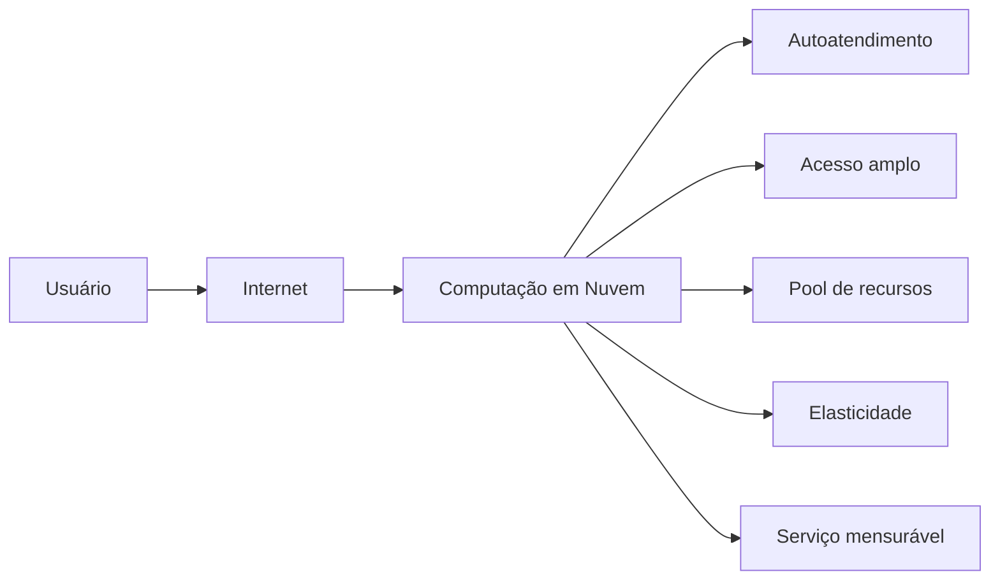

A migração para a nuvem também representa uma mudança de **CAPEX** para **OPEX**: em vez de investir diretamente em hardware próprio, a organização paga pelos recursos utilizados.

---

## 2. Sistema Operacional e Virtualização

O **Sistema Operacional (SO)** é a camada que abstrai o hardware e gerencia seus recursos.

A **virtualização** permite executar várias máquinas virtuais sobre um único servidor físico.

O **hypervisor**, também chamado de VMM, é responsável pela camada de virtualização.

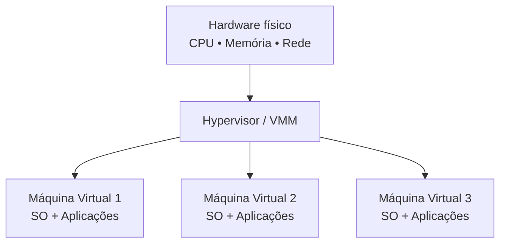

Exemplos de hypervisors citados na aula:

* VMware ESXi
* KVM

---

## 3. Recursos sob Demanda

### Self-service

O usuário pode provisionar recursos sem precisar da intervenção humana do provedor.

### Elasticidade

Permite aumentar ou reduzir recursos automaticamente conforme a demanda.

### Escalabilidade

É a capacidade do sistema de crescer para suportar cargas maiores.

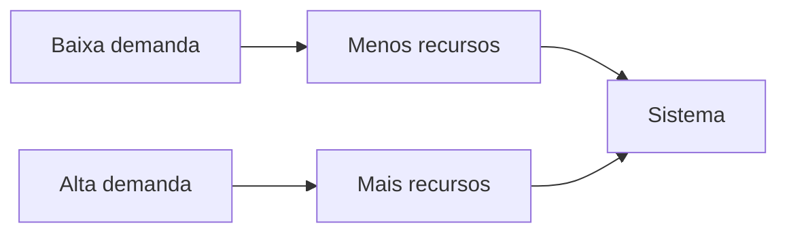

---

## 4. Alta Disponibilidade

Para aumentar a disponibilidade de uma aplicação, a nuvem pode utilizar:

1. **Zonas de disponibilidade** — datacenters separados dentro de uma região.
2. **Balanceamento de carga** — distribui requisições entre várias instâncias.
3. **Replicação de dados** — mantém cópias dos dados.
4. **Failover automático** — redireciona o tráfego quando uma instância apresenta falha.

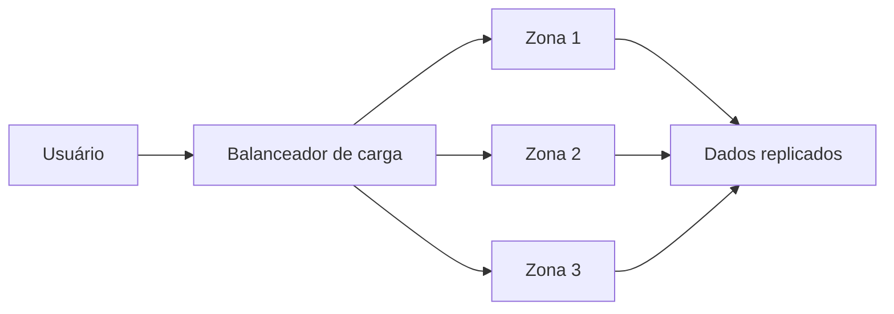

---

# 5. Modelos de Serviço

Existem três modelos principais apresentados na aula:

## IaaS — Infrastructure as a Service

O provedor fornece a infraestrutura virtualizada.

O cliente administra:

* Sistema Operacional
* Middleware
* Runtime
* Aplicações

Exemplos:

* AWS EC2
* Google Compute Engine
* Azure Virtual Machines

## PaaS — Platform as a Service

O provedor administra a infraestrutura e a plataforma.

O desenvolvedor concentra-se principalmente no **código e na aplicação**.

Exemplos:

* Google App Engine
* Azure App Service
* Heroku
* AWS Elastic Beanstalk

## SaaS — Software as a Service

É um software completo disponibilizado pela internet.

O provedor gerencia toda a infraestrutura, plataforma e software.

Exemplos:

* Google Workspace
* Microsoft 365
* Salesforce
* Slack
* Zoom

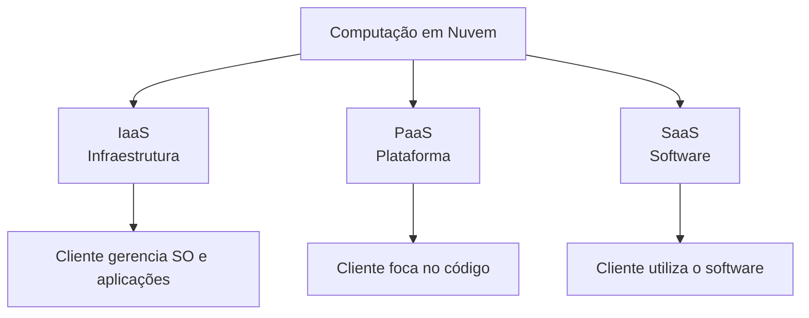

**Para memorizar:**

> **IaaS → Infraestrutura**
> **PaaS → Plataforma**
> **SaaS → Software**

---

# 6. Principais Provedores

### AWS

Amazon Web Services. Possui grande quantidade de serviços e amplo ecossistema.

### Azure

Microsoft Azure. Forte integração com o ecossistema Microsoft.

### GCP

Google Cloud Platform. Destaca-se em Big Data, IA/ML e containers.

Outros citados:

* Oracle Cloud
* IBM Cloud
* Alibaba Cloud
* Locaweb

---

# 7. Modelos de Implantação

## Nuvem Pública

Infraestrutura compartilhada entre vários clientes.

**Vantagens:** escalabilidade e menor custo.

Exemplos:

* AWS
* Azure
* GCP

## Nuvem Privada

Infraestrutura dedicada a uma única organização.

Oferece maior controle, segurança e customização.

## Nuvem Híbrida

Combina nuvem pública e privada.

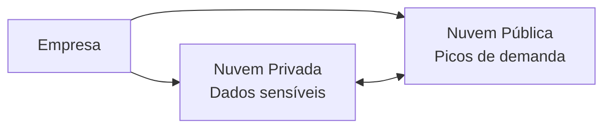

---

# 8. Vantagens e Desafios

### Vantagens

* Redução de investimentos em hardware.
* Escalabilidade sob demanda.
* Alta disponibilidade.
* Resiliência geográfica.
* Acesso global.
* Colaboração remota.
* Acesso a serviços de IA, Analytics e IoT.

### Desafios

* **Vendor lock-in:** dependência de serviços proprietários.
* Segurança e conformidade.
* Custos imprevisíveis sem governança.
* Latência de rede.
* Complexidade de ambientes híbridos e multicloud.

---

# 9. Segurança na Nuvem

A aula apresenta o conceito de **Responsabilidade Compartilhada**.

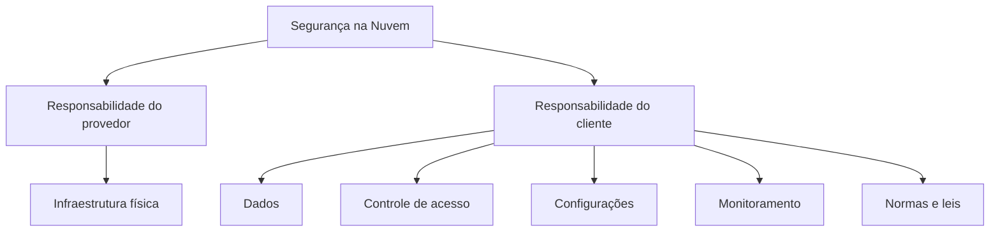

De forma simplificada:

**Provedor → segurança da nuvem**

**Cliente → segurança dentro da nuvem**

---

# 10. Containers e Microsserviços

## Containers

Um container empacota a aplicação e suas dependências em uma unidade isolada.

Características:

* Leves.
* Portáteis.
* Inicialização rápida.
* Compartilham o kernel do SO hospedeiro.

### Docker

É apresentado como padrão de fato para criação e distribuição de containers.

### Kubernetes

Responsável pela orquestração, escalabilidade automática e alta disponibilidade de containers.

## Microsserviços

Uma aplicação é dividida em vários serviços independentes.

Cada serviço possui uma responsabilidade específica e se comunica através de APIs.

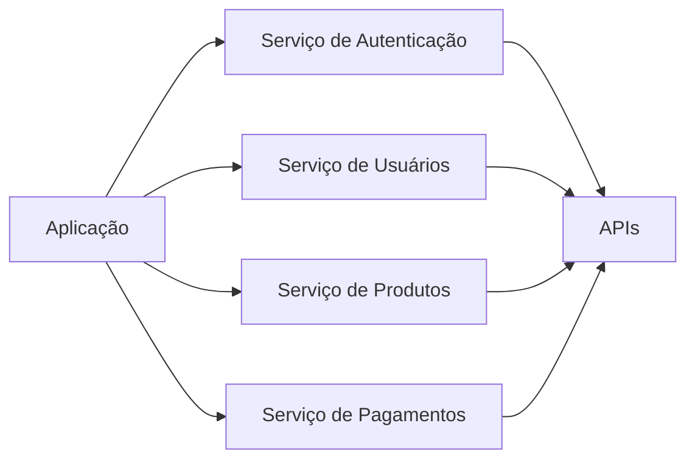

---

# 11. Backend e Web Service

O **backend** processa requisições, gerencia dados e fornece respostas aos clientes.

Principais funções:

* Armazenar e recuperar dados.
* Executar regras de negócio.
* Fornecer APIs.

Um **Web Service** é um serviço acessível pela web que permite comunicação entre diferentes sistemas através de HTTP/HTTPS.

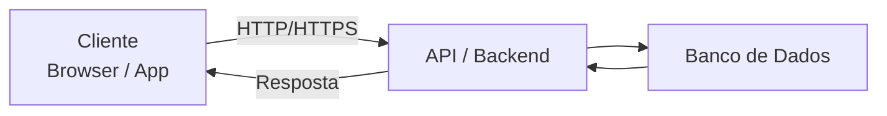

---

# 12. API REST com Express

A aula utiliza **Express.js** para criação de uma API REST.

Fluxo básico:

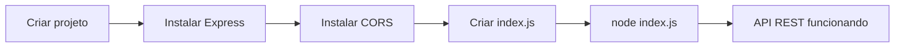

Comandos apresentados:

```bash
npm install express
npm install cors express
node index.js
```

**CORS** é um mecanismo de segurança que controla o acesso entre diferentes domínios no navegador.

---

# 13. Deploy com Render

O **Render** é uma plataforma de hospedagem em nuvem que suporta Node.js e permite integração com repositórios Git.

O processo apresentado é:

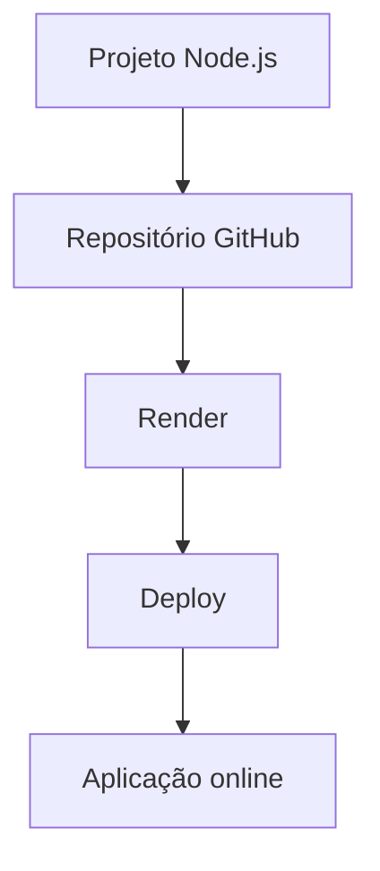

### Passos

1. Enviar o projeto para o GitHub.
2. Criar uma conta no Render.
3. Criar um **Web Service**.
4. Conectar o repositório GitHub.
5. Configurar o comando de inicialização.
6. Fazer o deploy.
7. Acessar a aplicação pelo endereço `.onrender.com`.

---

# 14. Atividade da Aula

A atividade pede a criação de uma aplicação chamada:

```text
cloud-so-app
```

A aplicação deve utilizar **Express.js** e **Node.js** para mostrar informações do sistema operacional:

* Hostname
* Plataforma
* Arquitetura
* Quantidade de CPUs
* Memória total
* Memória livre
* Uptime

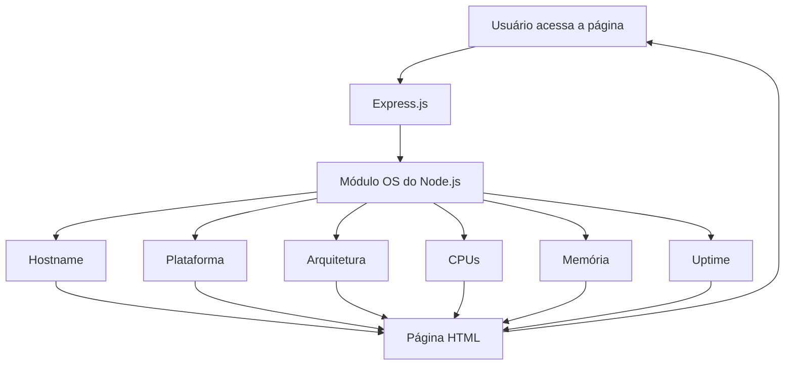

Depois, o projeto deve ser enviado ao **GitHub**, publicado no **Render** e comparado entre a execução local e a execução na nuvem.

---

# 🧠 Resumo para Prova

| Conceito            | O que significa                                     |
| ------------------- | --------------------------------------------------- |
| **Cloud Computing** | Recursos computacionais disponibilizados pela rede  |
| **Elasticidade**    | Aumentar/reduzir recursos conforme demanda          |
| **Escalabilidade**  | Capacidade de crescer para suportar maior carga     |
| **Virtualização**   | Criação de ambientes virtuais sobre hardware físico |
| **Hypervisor**      | Software responsável pela virtualização             |
| **IaaS**            | Infraestrutura como serviço                         |
| **PaaS**            | Plataforma como serviço                             |
| **SaaS**            | Software como serviço                               |
| **Nuvem Pública**   | Infraestrutura compartilhada                        |
| **Nuvem Privada**   | Infraestrutura dedicada                             |
| **Nuvem Híbrida**   | Combinação de pública e privada                     |
| **Container**       | Aplicação + dependências em ambiente isolado        |
| **Docker**          | Criação/distribuição de containers                  |
| **Kubernetes**      | Orquestração de containers                          |
| **Microsserviços**  | Aplicação dividida em serviços independentes        |
| **Backend**         | Processa requisições e regras de negócio            |
| **API REST**        | Interface para comunicação entre sistemas           |
| **Express.js**      | Framework Node.js usado para APIs/web               |
| **CORS**            | Controle de acesso entre diferentes domínios        |
| **Render**          | Plataforma para hospedagem/deploy em nuvem          |

## 🔑 O que mais importa entender

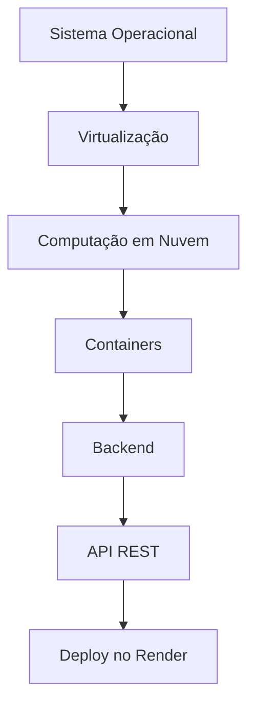

A ideia central da aula é conectar **Sistemas Operacionais → Virtualização → Nuvem → Containers → Backend → APIs → Deploy**, terminando na aplicação prática `cloud-so-app`.
